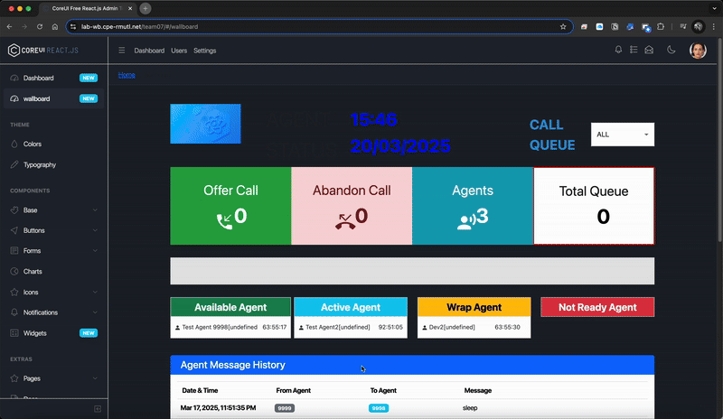
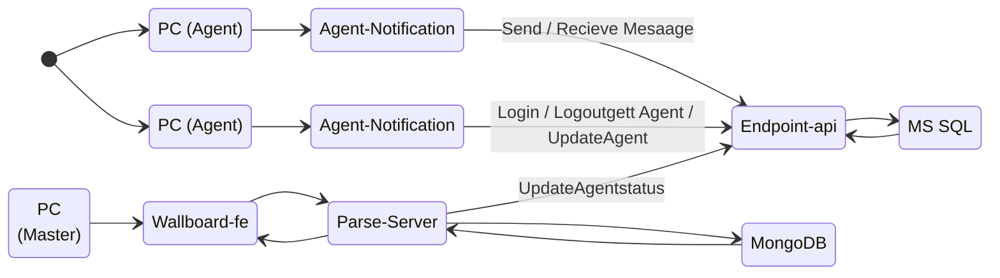

# ENGCE301 - Final LAB Solution

This is our Solution for the Final LAB in ENGCE301 Class

## 📋 Overview Web interface

  

## 📚 API Specification Documentation

📑 [View Complete API Documentation](./Document/README.md)

## ✅ Test Cases

### Agent Notification

| Test ID | Description | Test Steps | Expected Results | Actual Results |
|:-------:|:------------|:-----------|:----------------|:---------------|
| **R 1.1** | **Login Authentication** | 1. Navigate to login page 2. Enter valid username and password 3. Click login button | System grants access if credentials are valid | System granted access as expected |
| **R 1.2** | **Login/Logout Record Keeping** | 1. Login to the system 2. Logout from the system 3. Check activity logs | Login and logout activities are recorded with correct timestamps | Records are complete and timestamps are accurate |
| **R 1.3** | **Status Change History** | 1. Login to the system 2. Change agent status 3. Review status logs | Status changes are recorded with start and end times | Status changes completely recorded |
| **R 1.4** | **Agent Conversation Logging** | 1. Initiate chat 2. Send and receive multiple messages 3. Check chat history | System records all conversation messages | All conversation messages recorded |

### Agent Wallboard

| Test ID | Description | Test Steps | Expected Results | Actual Results |
|:-------:|:------------|:-----------|:----------------|:---------------|
| **R 2.1** | **Wallboard Banner Display** | 1. Navigate to Wallboard page 2. Verify banner appears correctly | Banner displays according to configured settings | Banner displayed as configured |
| **R 2.2** | **Login/Logout and Status History Display** | 1. Navigate to Wallboard page 2. Review login, logout and status history | All history displayed correctly | History data displayed completely and accurately |
| **R 2.3** | **Agent Conversation History Display** | 1. Navigate to Wallboard page 2. View agent chat history | All conversation history displayed correctly | Conversation history displayed completely |

## 📊 Data Flow Diagrams

  

## 🗃️ ER Diagrams

  

## 🔄 Activity Flow Diagram

## 👥 Our Team

| Profile | Name | Student ID | Role |
|:-------:|:-----|:-----------|:-----|
|  | Papon Saejar | 65543206021-9-7 | System Analyst & Tester |
|  | Sarayut Meepanya | 65543206037-5 | Team Leader & Developer |

## 📁 Our Team GitHub Repository

Visit Sarayut project repository: [Github-SarayutMI](https://github.com/SarayutMI)

Visit Papon project repository: [Github-Paponsaeja](https://github.com/Paponsaeja)

---

  <i>Submitted March 2025 • Department of Computer Engineering</i>

