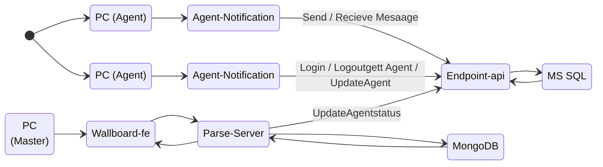

# engce301 - LAB6 Solution

This our Solution for LAB6 in ENGCE301 Class

##  Overview

     
    
     

##  **API Specification Docs**

Link to API Specification Documentation: [This Link](./Document/README.md).

## Test Case (Agent Notification)
| รายละเอียดการทดสอบ | รายละเอียดการทดสอบ | วิธีการทดสอบ | ผลลัพธ์ที่คาดหวัง | ผลการทดสอบ|
|----------|----------|----------| ----------| ----------|
| R 1.1| ตรวจสอบการล็อกอินด้วยรหัสผ่าน|1. เข้าไปที่หน้าเข้าสู่ระบบ 2. กรอกชื่อผู้ใช้และรหัสผ่านที่ถูกต้อง 3. กดปุ่มล็อกอิน | ระบบอนุญาตให้เข้าใช้งานได้หากข้อมูลถูกต้อง | ระบบอนุญาตให้เข้าใช้งานได้ตามที่คาดหวัง|
|R 1.2|ตรวจสอบการเก็บบันทึกการล็อกอินและล็อกเอาต์ | 1. ล็อกอินเข้าสู่ระบบ 2. ออกจากระบบ 3. ดูบันทึกกิจกรรม|บันทึกการล็อกอินและล็อกเอาต์พร้อมระบุเวลาที่ถูกต้อง|บันทึกข้อมูลครบถ้วนและถูกต้องตามเวลา|
|R 1.3| ตรวจสอบการบันทึกประวัติการปรับเปลี่ยนสถานะ| 1. เข้าสู่ระบบ 2. เปลี่ยนสถานะของตัวแทน 3. ตรวจดูบันทึกสถานะ|บันทึกการเปลี่ยนสถานะพร้อมระบุเวลาเริ่มและสิ้นสุด|การเปลี่ยนสถานะถูกบันทึกอย่างสมบูรณ์|
|R 1.4|ตรวจสอบการเก็บบันทึกการสนทนาของตัวแทน|1. เริ่มแชท 2. ส่งและรับข้อความหลายครั้ง 3. ตรวจสอบประวัติการแชท|ระบบบันทึกข้อความทั้งหมดของการสนทนา|ข้อความการสนทนาถูกบันทึกทั้งหมด|

**Test Case (Agent Wallboard)**

| รายละเอียดการทดสอบ | รายละเอียดการทดสอบ | วิธีการทดสอบ | ผลลัพธ์ที่คาดหวัง | ผลการทดสอบ|
|----------|----------|----------| ----------| ----------|
|R 2.1| ตรวจสอบการแสดงผลแบนเนอร์บน Wallboard|1. เข้าไปที่หน้า Wallboard 2. ดูว่าแบนเนอร์ปรากฏถูกต้องหรือไม่|แบนเนอร์แสดงผลตามการตั้งค่าที่กำหนด|แบนเนอร์แสดงผลได้ตามที่กำหนดไว้
|R 2.2|ตรวจสอบการแสดงข้อมูลประวัติการล็อกอิน ล็อกเอาต์ และสถานะ|1. เข้าไปที่หน้า Wallboard 2. ตรวจสอบประวัติการล็อกอิน ล็อกเอาต์ และสถานะ|แสดงประวัติทั้งหมดอย่างถูกต้อง|ข้อมูลประวัติแสดงผลครบถ้วนและถูกต้อง
|R 2.3|ตรวจสอบการแสดงประวัติการสนทนาของตัวแทน|1. เข้าไปที่หน้า Wallboard 2. ดูประวัติการแชทของตัวแทน|แสดงประวัติการสนทนาทั้งหมดอย่างถูกต้อง|ประวัติการสนทนาแสดงผลได้อย่างสมบูรณ์

## Data Flow Diagrams

     
    
     

## ER Diagrams

     
    
     

    
## **Activity Flow Diagram**

## Our Team
| Name | Student ID | ROLE |
|----------|----------|----------|
| นาย ปพน แซ่จ๊ะ | 65543206021-9-7 | System Analyst & Tester|
| นาย ศรายุทธ มีปัญญา | 65543206037-5 | Team Leader & Developer |
